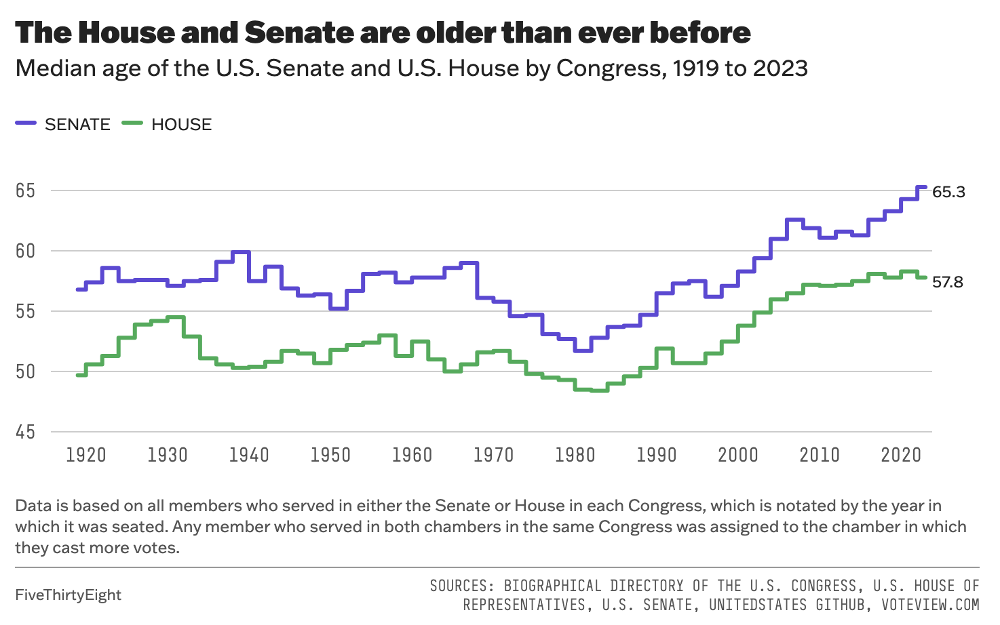

```{r setup, include=FALSE}
# Do not modify this chunk.
knitr::opts_chunk$set(echo = TRUE, warning = FALSE, message = FALSE)
```

```{r}
# Put all necessary libraries here
# I got you started!
# The first time you want to install the dsbox package; then you can comment it out.
# If you have not installed the devtools package, you will need to do so first
# install.packages("devtools")
# library(devtools)

devtools::install_github("tidyverse/dsbox")
library(dsbox)
library(tidyverse)
library(viridis)
```


## Due: Thursday, February 8th at 8:30am

## Goals of this lab

1. Practice coding to adhere to the Tidyverse Style Guide.
1. Practice creating and refining graphs with `ggplot2`.
1. Consider the strengths and weaknesses of various `geom`s and `aes`thetics for telling a data story.

## Notes:

* When creating your graphs, consider context (i.e. axis labels, title, ...)!
* If I provide partially completed code, I will put `eval = FALSE` in the chunk.  Make sure to change that to `eval = TRUE` once you have completed the code in the chunk.
* Be prepared to ask for help from me, Simon, and your classmates!  We scratched the surface of `ggplot2` in class.  But I encourage you to really dig in and make your graphs your own (i.e. don't rely on defaults).


## Problems


### Probem 1: Road traffic injuries in Edinburgh, Scotland 

The dataset can be found in the `dsbox` package, and is called `accidents`. It covers all recorded accidents in Edinburgh in 2018; compared to the dataset made available by the UK government, some of the variables were modified for the purposes of the package. You can find out more about the dataset by inspecting its documentation with `?accidents`. Recreate the following plot, and interpret the results.


```{r, out.width="100%", echo=FALSE}
knitr::include_graphics("../img/edi-accidents-1.png")
```
```{r}
data(accidents)

accidents <- accidents %>% 
  mutate(daytype = case_when(day_of_week == "Monday" | 
                               day_of_week == "Tuesday"| 
                               day_of_week == "Wednesday"| 
                               day_of_week == "Thursday"| 
                               day_of_week == "Friday" ~ "Weekday", 
                             day_of_week == "Saturday"| 
                               day_of_week == "Sunday" ~ "Weekend"))


ggplot(data = accidents, aes(x = time)) +
  geom_density(aes(fill=severity),alpha=.5) +
  facet_grid(daytype ~.) +
  scale_fill_manual(breaks = c("Fatal", "Serious", "Slight"), 
                    values=c("#9B7DA1", "#80C1BD", "#FFF27E"))+
  labs(x="Time of Day", 
       y="Density", 
       fill = "Severity", 
       title = "Number of accidents throughout the day", 
       subtitle = "By day of week and severity")

```


### Problem 2: One Dataset, Visualized ~~25~~ 5 Ways

Inspired by Nathan Yau's [One Dataset, Visualized 25 Ways](https://flowingdata.com/2017/01/24/one-dataset-visualized-25-ways/), I want you to create 5 visualizations of the same data. You can use the `mpg` dataset or another dataset of your choosing, including the `accidents` dataset above. Make sure you have the data manual open for this problem!  

a. Pick 3 - 4 variables you want to explore.  Provide their code names here.
class, hwy, year

b. Create 5 graphs.  A few things to consider:
    + Like Nathan's graphs, they don't all have to contain every one of your selected variables.
    + You can't use the same `geom` for all four graphs but you can use the same `geom` more than once.
    + Think carefully about color, the coordinate system, and scales.
    + Feel free to subset or wrangling the dataset if you want to but it isn't required.

c. Discuss the pros/cons of your graphs.  What useful information can be gleaned?  How do the different geoms and aesthetics impact the story?

```{r}
data(mpg)
mpg <- mpg %>% 
  mutate(chryear = case_when(year == 2008 ~ as.character("2008"), 
                             year == 1999 ~ as.character("1999")))

#boxplot of highway mpg by manufacturer
ggplot(data = mpg, aes(x = reorder(manufacturer, hwy, FUN = median), y = hwy)) +
  geom_boxplot(fill = "plum") +
  labs(x="Manufacturer", 
       y = "Highway MPG", 
       title = "Boxplot of Highway MPG by Manufacurer's") +
    theme(axis.text.x = element_text(angle = 45, hjust = 1)) 
```

This graph is useful in comparing the different manufacturers. The boxplots also point to the ranges in highway mpg across their cars however, it doesn't explain why this is the case (different classes of vehicles etc). Ordering it from lowest to highest median made it more legible than shuffled around and allows ranking of manufacturers in a clear way.

```{r}
#histogram of num cars from each manufacturer colored by class
ggplot(data = mpg, aes(x = manufacturer, fill = class)) +
  geom_histogram(stat = "count",binwidth = 1) +
  theme(axis.text.x = element_text(angle = 45, hjust = 1)) +  #rotate
  labs(x="Manufacturer", 
       y="Cars Count", 
       color = "Vehicle Class", 
       title = "Histogram of Vehicle Class and Number of Cars produced by Manufacturers")
```

This graph effectively contextualize the ranking of the earlier graph by showing the differences in composition of the manufacturers. Some manufacturers don't make all the different classes of cars which would impact average mpg. The histogram is good for showing counts but the fill=class changes the story, and provides this necessary context. 

```{r}
#barplot of average highway mpg across manufacturer
mpg_avg <- mpg %>%
  group_by(manufacturer) %>%
  summarize(avg_mpg = mean(hwy, na.rm = TRUE)) %>%
  arrange(desc(avg_mpg)) 
ggplot(data = mpg_avg, aes(x = reorder(manufacturer, avg_mpg), y = avg_mpg)) +
  geom_bar(stat = "identity", width = 0.5, fill = "plum") +
  labs(x = "Manufacturer", 
       y = "Average Highway MPG", 
       title = "Average Highway MPG across Manufacturers") +
  theme(axis.text.x = element_text(angle = 45, hjust = 1))  #rotate
```

This graph is similar to the first one, a boxplot version of this same story/information. Changing the geom to a bar plot serves to simplify this information. While it's less informative/detailed, it is more legible for general viewers.

```{r}
#boxplot of highway mpg across class
ggplot(data =mpg, aes(x=class, y=hwy)) +
  geom_boxplot(fill="plum") + 
    labs(title="Highway MPG by Class of Vehicle", 
         x="Vehicle Class", 
         y="Highway MPG")
```

This graph adds more context to prior graphs showing the general trends in highway mpg by vehicle class. Considering this graph along with the histogram of #of cars produced by each manufacturer and their breakdown by class, indicates that it's not quite fair to compare the general averages when manufacturer's don't produce the same kinds or quantities of vehicle which are inherantly different. 

```{r}
# Calculate average highway MPG for each manufacturer in each year (connected points plot)
mpg_avgman <- mpg %>%
  group_by(manufacturer, chryear) %>%
  summarize(avg_hwy = mean(hwy, na.rm = TRUE)) %>%
  ungroup()

ggplot(data = mpg_avgman, aes(x = as.factor(chryear), 
                              y = avg_hwy, group = manufacturer, 
                              color = manufacturer)) +
  geom_line() +
  geom_point() +
  labs(x = "Year", 
       y = "Average Hwy MPG", 
       title = "Average Hwy MPG by Manufacturer and Year")

```

This graph has similar cons as the others in the lack of context associated with 'average highway mpg' as a variable. However, this graph is useful in showing the trends over time and improvement within manufacturers. 

### Problem 3: Style This Code!

Take the following code and don't change its functionality but DO change its style.  Use the [Tidyverse Style Guide](https://style.tidyverse.org/)!

```{r}
animal_weight = data.frame(weight = c(runif(3),NA),
                           animal = c("cat","mouse","dog","rat"))

median(animal_weight$weight, TRUE);
mean(animal_weight$weight, 0 , TRUE); 
var(animal_weight$weight, NULL, TRUE)

ggplot(animal_weight, aes(y = weight, x = animal)) +
  geom_col(fill="plum") +
  scale_y_continuous() +
  labs(x="Animal Species", 
       y = "Weight (ibs)", 
       title = "Average Weight Across Animal Species")
```


### Problem 4: Imitation is the Sincerest Form of Flattery

For this problem, I want you to try to recreate a FiveThirtyEight.com graphic.  Awesomely, they share their data with the world [here](https://data.fivethirtyeight.com/).  (Note: You don't need to recreate all their branding/background color scheme.)

a. Take a screenshot of the graph, upload it to the same folder on the server where you have saved your lab, and insert the file name below.  Then change the `eval = FALSE` to `eval = TRUE`.


```{r, out.width="100%", echo=FALSE, eval = TRUE}

```


b. Load the data and recreate the graph as best as you can.  
```{r}
data_aging_congress <- read_csv("~/Rstudio/DataScience/math241repo/data/data_aging_congress.csv")

#data wrangling: df w start_year, chamber, age
data_aging_congress$start_year <- year(data_aging_congress$start_date)

aging_avrg <- data_aging_congress %>%
  group_by(start_year, chamber) %>%
  summarize(avg_age = median(age_years, na.rm = TRUE)) %>%
  ungroup()

ggplot(aging_avrg, aes(x=start_year, y=avg_age)) +
  geom_step(aes(color=chamber)) +
  scale_color_manual(breaks = c("Senate", "House"),
                     values=c("#024F7E", "#6ECC75"))+
  xlim(1920,2020)+
  ylim(45,65) +
  labs(x="", 
       y="",
       color="",
       title="The House and Senate are older than ever before",
       subtitle="Median age of the U.S. Senate and U.S House by Congress, 1919 to 2023", 
       caption="Data is based on all members who served in either the Senate or House in each Congress, which is notated by the year in which it was seated. Any member who served in both chambers in the same Congress was assigned to the chamber in which they cast more votes.") +
  theme(plot.title=element_text(face="bold"))+
  geom_text(x=2022.5, y=63.5, label = "65.3", size = 3) +
  geom_text(x=2022.5, y=57.8, label = "57.8", size = 3)

```

c. Now make the graph better somehow.

```{r}
# data wrangling, adding  parties + remove nas
data_aging_congress <- data_aging_congress %>% 
  mutate(party = case_when(party_code == 200 ~ "Republican", party_code == 100 ~ "Democrat"))

party_avrg <- data_aging_congress %>%
  group_by(start_year, chamber, party) %>%
  summarize(avg_age = median(age_years, na.rm = TRUE)) %>%
  ungroup()
party_avrg <- na.omit(party_avrg)


ggplot(party_avrg, aes(x=start_year, y=avg_age)) +
  geom_step(aes(color= party)) +
  scale_color_manual(breaks = c("Democrat", "Republican"),
                     values=c("#024F7E", "maroon"))+
  facet_grid(.~chamber) +
  xlim(1920,2020)+
  ylim(45,65) +
  labs(x="", 
       y="",
       color="",
       title="The House and Senate are older than ever before, across parties",
       subtitle="Median age of the U.S. Senate and U.S House by Congress and by party, 1919 to 2023", 
       caption="Data is based on all members who served in either the Senate or House in each Congress, which is notated by the year in which it was seated. Any member who served in both chambers in the same Congress was assigned to the chamber in which they cast more votes.") +
  theme(plot.title=element_text(face="bold"))
```


d. Justify why your rendition of this `FiveThirtyEight.com` graph is more effective at telling the data story than the original. 

My rendition confirms that this trend of increasing age is not associated with party affiliation. When I first saw 538's graph I wondered if there were other factors involved and my graph addresses a possible variable.

### Problem 5: Rental apartments in SF

The data for this exercise comes from `TidyTuesday`, and is on rental prices in San Francisco. You can find out more about the dataset by inspecting its documentation [here](https://github.com/rfordatascience/tidytuesday/tree/master/data/2022/2022-07-05). The dataset you'll be using is called `rent`. Create a visualization that will help you compare the distribution of rental prices (`price`) per bedroom (`beds`) across neighborhoods (`nhood`) in the city of San Francisco `(city == "san francisco")`, over time. 

Limit your analysis to rentals where the full unit is available, i.e. (`room_in_apt	== 0`). You have the flexibility to choose which years and which neighborhoods. Note that you should have a maximum of 8 neighborhoods on your visualization, but one or more of them can be a combination of many (e.g., an "other" category). Your visualization should also display some measure of the variability in your data.
You get to decide what type of visualization to create and there is more than one correct answer! In your answer, include a brief description of why you made the choices you made as well as an interpretation of the findings of how rental prices vary over time and neighborhoods in San Francisco.

```{r, eval = F}
# Get the Data
# Read in with tidytuesdayR package
# Install from CRAN via: install.packages("tidytuesdayR")
# This loads the readme and all the datasets for the week of interest
library(tidytuesdayR)
tuesdata <- tidytuesdayR::tt_load('2022-07-05') # this could take a minute
rent <- tuesdata$rent

sfrent <- rent %>% 
  filter(room_in_apt == 0,
         city == "san francisco")

ggplot(data=sfrent, aes(x=year, y = price, color =beds)) +
  geom_line()


```

